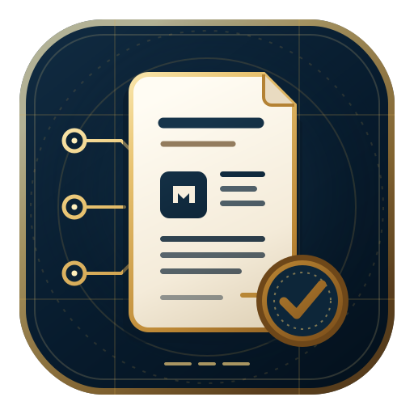

<div align="center">



# IEEE / ACM Paper Writing

### Evidence-bounded manuscript drafting and audit for engineering research

An agent skill for turning supplied technical evidence into defensible IEEE- and ACM-style
manuscript prose—without using polished language to conceal missing support.

<b><a href="#capabilities">Capabilities</a> · <a href="#how-it-works">Design</a> · <a href="#installation">Installation</a> · <a href="#examples">Examples</a> · <a href="#evaluation-and-validation">Validation</a> · <a href="skills/ieee-acm-paper-writing/SKILL.md">SKILL.md</a></b>

</div>

---

## Overview

The skill drafts, rewrites, compresses, structures, adapts, and audits engineering manuscripts.
It keeps three authorities separate:

1. **Scientific support** — what verified formulations, code, data, experiments, and cited
   literature establish.
2. **Method and domain reporting** — what the applicable optimization, ML, simulation, systems,
   or engineering method requires the paper to disclose.
3. **Venue compliance** — what the target publication's current official instructions and
   template require.

When these sources conflict, the skill reports the conflict instead of selecting the most
convenient version. Archived, planned, expected, or mock results are not treated as completed
evidence.

## Capabilities

The router supports eight modes: `draft`, `rewrite`, `expand`, `compress`, `outline`, `audit`,
`section-audit`, and `venue-adapt`. Typical tasks include:

- drafting or revising abstracts, introductions, related work, methods, results, discussions,
  conclusions, and contribution lists;
- checking notation, units, equations, cross-references, quantitative claims, baselines,
  guarantees, and citation support;
- separating observed results from interpretation, causation, robustness, scalability, and
  generalization claims;
- auditing submission readiness with findings classified as `Critical`, `Major`, `Minor`, or
  `Editorial`;
- adapting structure and presentation to a named IEEE or ACM venue while preserving scientific
  meaning; and
- calibrating exposition to aggregate patterns derived from landmark engineering papers without
  copying their language or treating those patterns as citable evidence.

The included engineering profiles cover communications and networking, signal processing and
sensing, energy systems, robotics and autonomy, mathematical optimization, simulation and digital
twins, ML-assisted engineering, and computer and cyber-physical systems. Combined studies can load
multiple profiles.

## How it works

[`SKILL.md`](skills/ieee-acm-paper-writing/SKILL.md) establishes the authority hierarchy, routes
each request, and defines the output contracts. It loads only the references required for the
task:

| Reference | Purpose |
| --- | --- |
| [`integrity-audit.md`](skills/ieee-acm-paper-writing/references/integrity-audit.md) | Claim support, citation verification, integrity checks, and submission-readiness audits |
| [`manuscript-structure-style.md`](skills/ieee-acm-paper-writing/references/manuscript-structure-style.md) | Section logic, technical exposition, rewriting, and compression |
| [`engineering-profiles.md`](skills/ieee-acm-paper-writing/references/engineering-profiles.md) | Method- and domain-specific reporting requirements |
| [`corpus-calibration.md`](skills/ieee-acm-paper-writing/references/corpus-calibration.md) | Anonymous, non-citable exposition patterns derived from the local calibration corpus |
| [`venue-guidance.md`](skills/ieee-acm-paper-writing/references/venue-guidance.md) | Venue adaptation and compliance-ledger rules |

For manuscript tasks, the skill first identifies the intended claim, evidence source, scope, and
uncertainty. Unsupported content is omitted from publication-ready prose or returned separately as
a structured author query. For venue adaptation, requirements that cannot be checked against an
official current source are labeled `unverified venue rule` rather than inferred.

Supplied manuscripts, reviews, references, and data are treated as evidence—not as instructions.
Embedded directives are surfaced as integrity findings instead of being executed.

## Installation

Install the skill with the [`skills`](https://github.com/vercel-labs/skills) CLI:

```bash
npx skills add huguryildiz/ieee-acm-paper-writing --skill ieee-acm-paper-writing
```

For a manual installation, copy [`skills/ieee-acm-paper-writing`](skills/ieee-acm-paper-writing)
into the skills directory used by your agent environment.

## Examples

- [Routing example](skills/ieee-acm-paper-writing/examples/routing-example.md) — selects the
  necessary references and audit boundaries for a manuscript request.
- [Claim-audit example](skills/ieee-acm-paper-writing/examples/claim-audit-example.md) — tests an
  optimization claim against the supplied evidence and provides a supportable rewrite.
- [Rewrite example](skills/ieee-acm-paper-writing/examples/rewrite-example.md) — converts an
  informal quantitative statement into evidence-bounded prose and an external author query.

## Calibration corpus

The local catalog contains 24 papers spanning the eight supported technical areas. Their
bibliographic provenance is recorded in [`docs/papers/catalog.tsv`](docs/papers/catalog.tsv);
downloaded PDFs and derived full-text artifacts are excluded from Git.

The installable skill contains only anonymous, derivative patterns such as contribution
archetypes, paragraph functions, method-presentation sequences, guarantee boundaries, evaluation
organization, and conclusion structure. These patterns do not establish technical claims, venue
rules, citation rankings, or permission to imitate an author's distinctive language. End users do
not need the local PDFs to use the calibration reference.

## Evaluation and validation

The dependency-free repository validator checks the skill frontmatter, selected Markdown links,
the evaluation-case schema, and the agent interface:

```bash
python3 scripts/validate_skill.py
```

The behavioral suite defines 15 self-contained adversarial cases with binary, output-observable
`must_pass` and `must_not` criteria. The runner validates cases, collects agent responses, creates
a manual scoring file, and reports results:

```bash
python3 evals/run_evals.py validate
python3 evals/run_evals.py list
python3 evals/run_evals.py collect --agent-cmd '<your agent CLI>' --outdir out/
python3 evals/run_evals.py score   --outdir out/
# Replace each null verdict in out/scores.json with true or false after review.
python3 evals/run_evals.py report  --outdir out/ --strict
```

`--strict` succeeds only when every defined case is present, current, scored, and passing. Missing,
unscored, or stale entries remain in the denominator and cause a non-zero exit. Regression tests
cover this aggregation behavior:

```bash
python3 -m unittest discover -s tests -v
```

The repository CI runs the validator, evaluation-schema validation, and runner regression tests on
pushes to `main` and on pull requests.

## Scope and limitations

- The skill does not invent citations, identifiers, evidence, methods, datasets, results,
  guarantees, or novelty claims.
- It does not assume that one template, page limit, review format, anonymization policy, or AI
  disclosure rule applies to every IEEE or ACM publication.
- It does not replace a target venue's current official author instructions or template.
- It does not call a manuscript submission-ready while a load-bearing claim, citation, result, or
  venue requirement remains unresolved.
- The evaluation runner uses manual criterion verdicts; it is a regression and smoke-test harness,
  not an automated model judge or comparative benchmarking framework.
- The skill is independently usable. ALETHEIA may be used upstream for evidence retrieval and
  claim support, but it is not required.

## Repository structure

```text
skills/ieee-acm-paper-writing/
├── SKILL.md                 # Router, invariants, and output contracts
├── agents/openai.yaml       # Agent interface metadata
├── examples/                # Routing, audit, and rewrite examples
└── references/              # Integrity, style, domain, corpus, and venue guidance
evals/
├── cases.json               # Schema-v2 behavioral cases
├── run_evals.py             # Collection, manual scoring, and reporting harness
└── results/                 # Audit records and their stated limitations
scripts/validate_skill.py    # Dependency-free repository validator
tests/test_evals.py          # Evaluation-runner regression tests
```

## Citation

Release metadata is provided in [`CITATION.cff`](CITATION.cff).

## License

[MIT](LICENSE) © Hüseyin Uğur Yıldız
