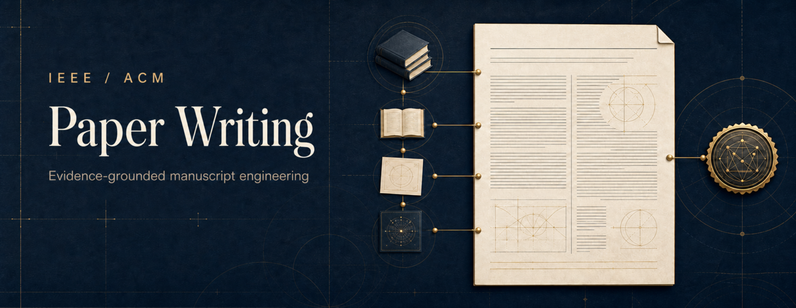
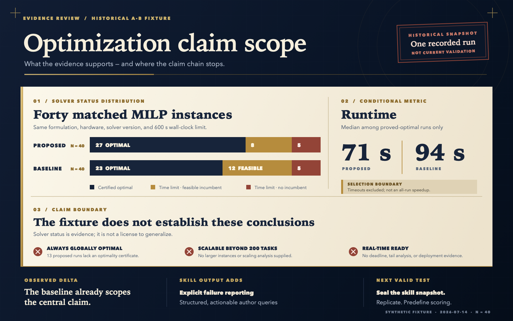

<div align="center">



# IEEE / ACM Paper Writing

### An evidence-grounded manuscript agent for IEEE and ACM engineering venues

It is designed to trace each claim to its supporting evidence, keep that evidence separate
from formatting concerns, check the reported numbers, and add nothing that the underlying
work does not establish.

[](https://github.com/huguryildiz/ieee-acm-paper-writing/actions/workflows/validate.yml)

<b><a href="#design">Design</a> · <a href="#examples">Examples</a> · <a href="#installation">Installation</a> · <a href="#what-this-skill-does-not-do">Scope</a> · <a href="#validation">Validation</a> · <a href="skills/ieee-acm-paper-writing/SKILL.md">SKILL.md</a></b>

</div>

---

An evidence-grounded agent skill for drafting, rewriting, adapting, and auditing rigorous
engineering manuscripts. It targets IEEE and ACM Transactions, journals, and conferences
without treating either publisher as a single universal format.

The skill supports:

- communications and networking;
- signal processing and sensing;
- energy systems;
- robotics and autonomy;
- mathematical optimization;
- simulation and digital twins;
- ML-assisted engineering;
- computer and cyber-physical systems.

## Design

The core separates three concerns that are often conflated:

1. **Scientific support** — what the verified formulation, code, data, experiments, and
   literature actually establish.
2. **Method and domain reporting** — what optimization, ML, simulation, systems, and
   engineering studies must disclose.
3. **Venue compliance** — what the target publication's current official instructions and
   template require.

The main router is
[`skills/ieee-acm-paper-writing/SKILL.md`](skills/ieee-acm-paper-writing/SKILL.md).
Detailed rules are loaded progressively from `references/`.

The reference layer is intentionally limited to five files: scientific integrity and audit,
manuscript structure and style, engineering profiles, anonymous corpus calibration, and venue
guidance. [`corpus-calibration.md`](skills/ieee-acm-paper-writing/references/corpus-calibration.md)
transfers the technical exposition and writing patterns derived from the 24 local PDFs without
including paper names, authors, identifiers, quotations, or citation rankings. End users do not
need the PDFs.

Local PDF provenance remains in [`docs/papers/catalog.tsv`](docs/papers/catalog.tsv), outside the
installable skill. PDFs are excluded from Git.

## Examples

- [Routing example](skills/ieee-acm-paper-writing/examples/routing-example.md) — selects the
  appropriate references and audit boundaries for a manuscript-review request.
- [Claim audit example](skills/ieee-acm-paper-writing/examples/claim-audit-example.md) — tests a
  strong optimization claim against the evidence supplied and provides a defensible rewrite.
- [Rewrite example](skills/ieee-acm-paper-writing/examples/rewrite-example.md) — turns an informal
  quantitative result into evidence-bounded manuscript prose and an external author query.

<p align="center">
  
</p>

<p align="center"><sub>Illustrative historical A/B fixture; this single-run snapshot is not current validation of the skill.</sub></p>

## Installation

Install it with a compatible skill installer (verified end-to-end with the
[vercel-labs `skills` CLI](https://github.com/vercel-labs/skills)):

```bash
npx skills add huguryildiz/ieee-acm-paper-writing --skill ieee-acm-paper-writing
```

For a manual installation, copy `skills/ieee-acm-paper-writing` into the skills directory
used by your agent environment.

## What this skill does not do

- It does not invent citations, evidence, novelty, or results.
- It does not claim that one IEEE or ACM template applies to every publication.
- It does not replace the target venue's current author instructions.
- It does not make a manuscript submission-ready when scientific or compliance evidence is
  missing.
- It does not require ALETHEIA. ALETHEIA can be used upstream for evidence retrieval and
  claim support, while this skill remains independently usable for manuscript production.

## Calibration corpus

The anonymous calibration layer covers communications and sensing, energy and robotics,
optimization, simulation and digital twins, ML-assisted engineering, and computer and
cyber-physical systems. It includes contribution archetypes, section and paragraph moves,
method-presentation sequences, guarantee boundaries, evaluation organization, conclusion patterns,
and modernization rules. It rejects sentence imitation, author fingerprints, unsupported novelty,
and corpus-derived venue rules.

## Validation

Run the vendored validator (Python 3 standard library only, no dependencies):

```bash
python3 scripts/validate_skill.py
```

It checks the `SKILL.md` frontmatter, every relative link, the evaluation-case
schema, and the agent interface file. The same checks run in CI on every push.

Behavioral evaluation cases live in [`evals/cases.json`](evals/cases.json):
15 self-contained adversarial prompts with binary, output-observable pass
criteria. [`evals/run_evals.py`](evals/run_evals.py) validates, collects,
scores, and reports them against any agent CLI:

```bash
python3 evals/run_evals.py validate
python3 evals/run_evals.py collect --agent-cmd '<your agent CLI>' --outdir out/
python3 evals/run_evals.py score   --outdir out/
python3 evals/run_evals.py report  --outdir out/
```

A single-run adversarial audit from 2026-07-14 is recorded in
[`evals/results/2026-07-14-behavioral-audit.md`](evals/results/2026-07-14-behavioral-audit.md);
it is existence evidence for the tested cases, not a statistical validation.

## License

MIT © Hüseyin Uğur Yıldız
