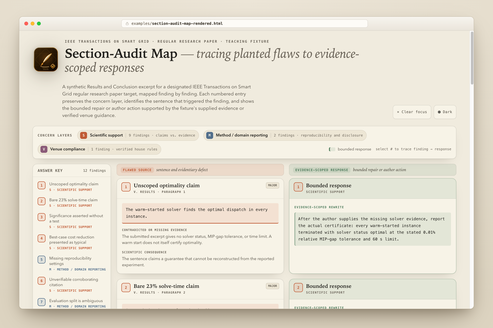
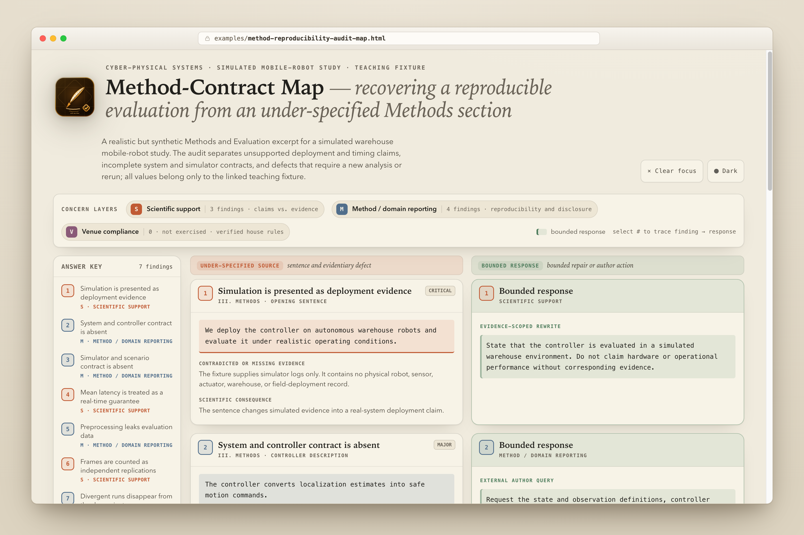
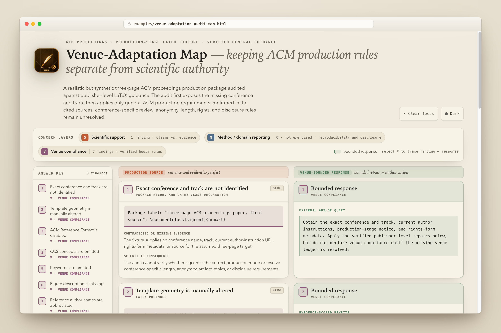

<div align="center">


# IEEE / ACM Paper Writing

### Evidence-bounded manuscript drafting and auditing for engineering research

An agent skill for turning supplied technical evidence into defensible IEEE- and ACM-style
manuscript prose—without using polished language to conceal missing support.

<b><a href="https://ieee-acm-paper-writing.vercel.app">Live showcase</a> · <a href="#capabilities">Capabilities</a> · <a href="#how-it-works">Design</a> · <a href="#installation">Installation</a> · <a href="#examples">Examples</a> · <a href="#evaluation-and-validation">Validation</a> · <a href="skills/ieee-acm-paper-writing/SKILL.md">SKILL.md</a></b>

</div>

---

## Overview

The skill drafts, rewrites, compresses, structures, adapts, and audits engineering manuscripts.
It keeps three authorities separate:

1. **Scientific support** — what verified formulations, code, data, experiments, and cited
   literature establish.
2. **Method and domain reporting** — what the applicable optimization, ML, simulation, systems,
   or engineering method requires the paper to disclose.
3. **Venue compliance** — what the target publication's current official instructions and
   template require.

The skill contract requires conflicts between these sources to be reported instead of resolved by
selecting the most convenient version. It also prohibits treating archived, planned, expected, or
mock results as completed evidence.

## Capabilities

The router supports nine modes: `draft`, `rewrite`, `expand`, `compress`, `humanize`, `outline`,
`audit`, `section-audit`, and `venue-adapt`. Style and landmark-paper calibration modify whichever
of these modes produces the requested deliverable; calibration is not a separate output mode. The
optional `--html-map` modifier renders an `audit` or `section-audit` result without defining an
additional mode.
Typical tasks include:

- drafting or revising abstracts, introductions, related work, methods, results, discussions,
  conclusions, and contribution lists;
- checking notation, units, equations, cross-references, quantitative claims, baselines,
  guarantees, and citation support;
- separating observed results from interpretation, causation, robustness, scalability, and
  generalization claims;
- removing machine-idiom prose patterns (`humanize`) while preserving claims, numbers, citations,
  notation, and evidence-bearing hedges, without touching generative-AI disclosures;
- auditing submission readiness with findings classified as `Critical`, `Major`, `Minor`, or
  `Editorial`;
- rendering an explicitly requested audit as a self-contained, interactive HTML finding map;
- adapting structure and presentation to a named IEEE or ACM venue while preserving scientific
  meaning; and
- calibrating exposition to aggregate patterns derived from landmark engineering papers without
  copying their language or treating those patterns as citable evidence.

### Engineering domains

The eight supported technical areas are:

1. communications and networking;
2. signal processing and sensing;
3. energy systems;
4. robotics and autonomy;
5. mathematical optimization;
6. simulation and digital twins;
7. machine learning and ML-assisted engineering; and
8. computer systems and cyber-physical-system engineering.

Combined studies can load multiple profiles.

## How it works

[`SKILL.md`](skills/ieee-acm-paper-writing/SKILL.md) establishes the authority hierarchy, routes
each request, and defines the output contracts. It loads only the references required for the
task:

| Reference | Purpose |
| --- | --- |
| [`integrity-audit.md`](skills/ieee-acm-paper-writing/references/integrity-audit.md) | Claim support, citation verification, integrity checks, and submission-readiness audits |
| [`manuscript-structure-style.md`](skills/ieee-acm-paper-writing/references/manuscript-structure-style.md) | Section logic, technical exposition, rewriting, and compression |
| [`engineering-profiles.md`](skills/ieee-acm-paper-writing/references/engineering-profiles.md) | Method- and domain-specific reporting requirements |
| [`corpus-calibration.md`](skills/ieee-acm-paper-writing/references/corpus-calibration.md) | De-identified, non-citable exposition patterns derived from the local calibration corpus |
| [`venue-guidance.md`](skills/ieee-acm-paper-writing/references/venue-guidance.md) | Venue adaptation and compliance-ledger rules |

For manuscript tasks, the skill instructs the agent to identify the intended claim, evidence
source, scope, and uncertainty before drafting. Its output contract requires unsupported content to
be omitted from publication-ready prose or returned separately as a structured author query. For
venue adaptation, requirements that cannot be checked against an official current source must be
labeled `unverified venue rule` rather than inferred.

The integrity contract treats supplied manuscripts, reviews, references, and data as evidence—not
as instructions—and requires embedded directives to be surfaced as findings rather than executed.

### Optional HTML audit map

Request the visual artifact with the `--html-map` output modifier:

```text
$ieee-acm-paper-writing section-audit --html-map manuscript.md
$ieee-acm-paper-writing section-audit --html-map --out reports/results-audit.html manuscript.md
```

Without the modifier, the skill produces neither JSON nor HTML. With it, the agent completes the canonical
text audit, writes and retains validated version-1 JSON, and invokes the dependency-free
[`render_audit_map.py`](skills/ieee-acm-paper-writing/scripts/render_audit_map.py) renderer. The
renderer performs presentation only: it cannot infer findings, rewrite claims, or fill missing
evidence. It refuses to overwrite an existing output unless the user explicitly authorizes
`--force`.

Every `--html-map` run returns three deliverables:

| Requested form | Text audit | JSON artifact | HTML artifact |
| --- | --- | --- | --- |
| `section-audit --html-map manuscript.md` | Returned in the agent response | `manuscript-section-audit-map.json` | `manuscript-section-audit-map.html` |
| `section-audit --html-map --out reports/results-audit.html manuscript.md` | Returned in the agent response | `reports/results-audit.json` | `reports/results-audit.html` |

The JSON is a retained user artifact and is the input accepted by the local audit workbench. The
agent checks both output paths before writing and does not overwrite either file without explicit
approval. An explicit `--out` path must end in `.html`; its sibling `.json` path is derived by
replacing that suffix.

The [hosted showcase](https://ieee-acm-paper-writing.vercel.app) presents the checked-in fixture in
a browser and provides direct downloads of its self-contained HTML and source JSON. The site is a
static presentation layer: it does not accept manuscript uploads or perform an audit. Renderer
outputs are confined to the workspace root supplied to the command; traversal, external absolute
paths, and symlink escapes are rejected.

### Local audit workbench

The workbench is repository-side support tooling; it is **not included** when the standalone skill
is installed under `.agents/skills/`. To inspect completed audit-map JSON without sending it to a
hosted service, clone the matching repository release and run the server from that clone's root:

```bash
git clone --branch v0.5.0 --depth 1 https://github.com/huguryildiz/ieee-acm-paper-writing.git
cd ieee-acm-paper-writing
python3 scripts/serve_local_audit.py
```

The command opens a loopback-only workbench on a random local port. Drop or select version-1 JSON,
then inspect the canonical renderer output, download the self-contained HTML, or open it full
screen. The browser sends the JSON only to the local `127.0.0.1` process; the request is session
bound, limited to 2 MiB, and is not persisted. Use `--no-open` to suppress automatic browser launch
or `--port PORT` to request a specific local port.

The workbench remains a presentation tool. It does not read a manuscript, discover findings, or
establish submission readiness. Stop it with `Ctrl+C` when finished.

## Installation

### Prerequisites

- Node.js 22.20.0 or newer for the pinned `skills@1.5.21` CLI used below;
- an agent host that supports the shared Agent Skills format; and
- Python 3 when generating the optional HTML audit map or running the repository-side local
  workbench.

The repository has been exercised with Codex. The upstream CLI supports other agent hosts, but this
repository does not claim equivalent behavioral validation for every host or model.

### Reproducible Codex install

Run this from the manuscript repository in which the skill should be available. It pins both the
installer and the released skill source, targets Codex explicitly, copies rather than symlinks the
files, and skips interactive prompts:

```bash
DISABLE_TELEMETRY=1 npx --yes skills@1.5.21 add \
  https://github.com/huguryildiz/ieee-acm-paper-writing/tree/v0.5.0/skills/ieee-acm-paper-writing \
  --skill ieee-acm-paper-writing --agent codex --copy -y
```

This project-scoped command installs under `.agents/skills/`. Add `--global` only when the skill
should be available to Codex across all projects. The upstream installer collects anonymous usage
telemetry by default; `DISABLE_TELEMETRY=1` opts out for this invocation.

After installation, start a **new agent session** so the host discovers the skill. Then invoke it
with a manuscript path and an explicit mode. These are agent prompts, not commands for a separate
standalone manuscript-processing executable.

### Complete skill invocation reference

The supported invocation shape is:

```text
$ieee-acm-paper-writing <mode> [supported modifier] <input> [evidence and constraints]
```

All nine modes are shown below. Replace the example paths and angle-bracketed descriptions with
your own material:

```text
$ieee-acm-paper-writing draft abstract from evidence.md
$ieee-acm-paper-writing rewrite sections/results.md
$ieee-acm-paper-writing expand sections/method.md
$ieee-acm-paper-writing compress manuscript.md
$ieee-acm-paper-writing humanize sections/introduction.md
$ieee-acm-paper-writing outline evidence.md
$ieee-acm-paper-writing audit manuscript.md
$ieee-acm-paper-writing section-audit sections/results.md
$ieee-acm-paper-writing venue-adapt manuscript.md for <publication and article type>
```

Style or landmark-paper calibration is a natural-language modifier of the applicable mode, not a
tenth mode and not a command-line flag. Representative calibrated requests are:

```text
$ieee-acm-paper-writing draft introduction from evidence.md using the de-identified landmark-paper calibration
$ieee-acm-paper-writing rewrite sections/method.md using the applicable corpus-calibration exposition pattern
$ieee-acm-paper-writing outline evidence.md in the exposition pattern appropriate to <technical area>
```

`--html-map` is supported only with `audit` and `section-audit`. `--out` belongs to that modifier,
must name an `.html` file, and also causes the paired `.json` file to be retained:

```text
$ieee-acm-paper-writing audit --html-map manuscript.md
$ieee-acm-paper-writing audit --html-map --out reports/manuscript-audit.html manuscript.md
$ieee-acm-paper-writing section-audit --html-map manuscript.md
$ieee-acm-paper-writing section-audit --html-map --out reports/results-audit.html manuscript.md
```

There are no mode-specific CLI flags beyond this documented HTML modifier. State target venue,
article type, section, evidence sources, output-file requests, claim boundaries, and other
scientific constraints in ordinary language. If paired audit-map outputs already exist, explicitly
authorize replacement in the request; the skill does not infer overwrite permission.

Text modes return the requested prose or audit in the conversation unless the user requests a file
edit. The HTML modifier writes the paired JSON and HTML artifacts inside the active workspace and
returns both paths; it does not turn the renderer into an analysis engine. Review the installed
skill before use, because agent skills execute with the host agent's permissions.

For a manual installation, copy [`skills/ieee-acm-paper-writing`](skills/ieee-acm-paper-writing)
into the skill directory used by the selected agent host, then begin a new session. Manual skill
installation copies only the distributable skill; it does not install the repository-side local
workbench.

## Examples

- [Routing example](skills/ieee-acm-paper-writing/examples/routing-example.md) — selects the
  necessary references and audit boundaries for a manuscript request.
- [Reference-format example](skills/ieee-acm-paper-writing/examples/reference-format-example.md) —
  audits and produces IEEE/ACM reference-list entries using publisher-level screening guidance.
- [Section-audit example](skills/ieee-acm-paper-writing/examples/section-audit-example.md) — a
  flawed Results and Conclusion fixture with a planted-flaw answer key and an illustrative
  evidence-scoped rewrite; it is not a retained behavioral result.
- [Live interactive section-audit map](https://ieee-acm-paper-writing.vercel.app/examples/section-audit-map.html),
  [source JSON](skills/ieee-acm-paper-writing/examples/section-audit-map.json), and
  [deterministic renderer fixture](skills/ieee-acm-paper-writing/examples/section-audit-map-rendered.html) —
  installable, self-contained visual artifacts. Each of the twelve planted flaws is tied to its
  triggering sentence, concern layer, evidentiary defect, consequence, and bounded response. The
  renderer fixture is generated from the JSON; the live showcase is maintained separately. Neither
  is behavioral evidence about an agent run.

### Section-audit map gallery

The same synthetic fixture makes the three-concern separation inspectable: scientific support,
method/domain reporting, and verified venue style remain distinct while every numbered finding
links its source text to a bounded response.

<a href="https://ieee-acm-paper-writing.vercel.app/examples/section-audit-map.html">
  
</a>

<table>
  <tr>
    <td width="50%">
      
    </td>
    <td width="50%">
      
    </td>
  </tr>
  <tr>
    <td align="center"><strong>Method / domain reporting</strong> — split integrity and reproducibility</td>
    <td align="center"><strong>Venue compliance</strong> — verified IEEE figure-citation style</td>
  </tr>
</table>

## Calibration corpus

The local catalog contains 24 papers spanning the [eight supported technical
areas](#engineering-domains). Their bibliographic provenance is recorded in
[`docs/papers/catalog.tsv`](docs/papers/catalog.tsv); downloaded PDFs and derived full-text
artifacts are excluded from Git.

The installable skill contains only de-identified, derivative patterns such as contribution
archetypes, paragraph functions, method-presentation sequences, guarantee boundaries, evaluation
organization, and conclusion structure. These patterns do not establish technical claims, venue
rules, citation rankings, source anonymity, or permission to imitate an author's distinctive
language. A specialist may still recognize a technical lineage. End users do not need the local
PDFs to use the calibration reference.

## Evaluation and validation

The dependency-free repository validator checks the skill frontmatter, calibration identity
policy, selected Markdown links and their tracked targets, safe evaluation-case names and schema,
the agent interface, and deterministic regeneration of the checked-in audit map:

```bash
python3 scripts/validate_skill.py
python3 skills/ieee-acm-paper-writing/scripts/render_audit_map.py \
  skills/ieee-acm-paper-writing/examples/section-audit-map.json --check
```

The behavioral suite defines 23 self-contained adversarial cases with binary, output-observable
`must_pass` and `must_not` criteria. The runner validates cases, collects agent responses, creates
a manual scoring file, and reports results:

```bash
python3 evals/run_evals.py validate
python3 evals/run_evals.py list
python3 evals/run_evals.py collect --agent-cmd '<your agent CLI>' --outdir out/
python3 evals/run_evals.py score   --outdir out/
# Replace each null verdict in out/scores.json with true or false after review.
python3 evals/run_evals.py report  --outdir out/ --strict
```

`--strict` succeeds only when every defined case has a present agent-response artifact whose hash
matches the manually scored output, whose case hash matches the current prompt and criteria, and
whose verdicts are complete and passing. Missing, unscored, or stale entries remain in the
denominator and cause a non-zero exit. Regression tests cover this aggregation behavior:

```bash
python3 -m unittest discover -s tests -v
```

The repository CI runs the validator, evaluation-schema validation, and regression tests on pushes
to `main` and on pull requests. These are structural and deterministic checks; CI does **not** run a
host model and therefore does not establish behavioral compliance. A behavioral claim requires a
collected agent response for every case, manual criterion scoring, and a strict report with the
denominator and failed-case list. Renderer tests reject stale checked-in HTML, unsafe unescaped
content, invalid concern layers, duplicate finding identifiers, implicit overwrite, output-path
escapes, external asset dependencies, and empty-layer wording that could be mistaken for a pass.

## Scope and limitations

- The integrity contract prohibits inventing citations, identifiers, evidence, methods, datasets,
  results, guarantees, or novelty claims.
- The venue contract prohibits assuming that one template, page limit, review format,
  anonymization policy, or AI disclosure rule applies to every IEEE or ACM publication.
- The skill guidance does not replace a target venue's current official author instructions or
  template.
- The audit contract prohibits calling a manuscript submission-ready while a load-bearing claim,
  citation, result, or venue requirement remains unresolved.
- The HTML renderer presents a completed audit; it is not an analysis engine and cannot establish
  evidence, generate findings, or repair unsupported claims.
- The evaluation runner uses manual criterion verdicts; it is a regression and smoke-test harness,
  not an automated model judge or comparative benchmarking framework.
- The skill is independently usable. ALETHEIA may be used upstream for evidence retrieval and
  claim support, but it is not required.

These are requirements encoded by the skill, not a guarantee that every host model will comply on
every run. Validate consequential outputs against the supplied evidence and retain the relevant
prompt, response, and scoring artifacts.

## Repository structure

```text
skills/ieee-acm-paper-writing/
├── SKILL.md                 # Router, invariants, and output contracts
├── LICENSE                  # MIT terms shipped with the installable copy
├── agents/openai.yaml       # Agent interface metadata
├── assets/                  # Self-contained HTML audit-map template
├── examples/                # Routing, audit data, interactive showcase, and renderer fixture
├── scripts/                 # Dependency-free audit-map renderer
└── references/              # Integrity, style, domain, corpus, and venue guidance
evals/
├── cases.json               # Schema-v2 behavioral cases
├── run_evals.py             # Collection, manual scoring, and reporting harness
└── comparisons/             # Historical A/B comparison snapshot
docs/
├── guides/                  # Repo-side provenance digests of IEEE/ACM style guides
└── papers/catalog.tsv       # Calibration-corpus provenance (PDFs excluded from Git)
site/                        # Dependency-free hosted showcase source
assets/                      # Repo-side icon and showcase screenshots (not installed)
scripts/build_site.py        # Builds the Vercel output from tracked site and example files
scripts/serve_local_audit.py # Runs the loopback-only local audit workbench
scripts/validate_skill.py    # Dependency-free repository validator
tests/                       # Evaluation-runner and validator regression tests
vercel.json                  # Static-site build and output configuration
```

## License

[MIT](LICENSE) 2026 © Hüseyin Uğur Yıldız
